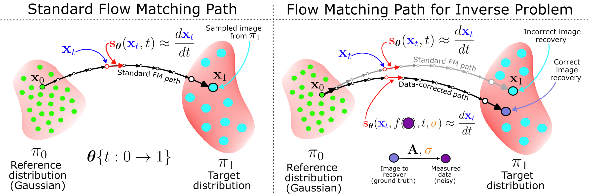
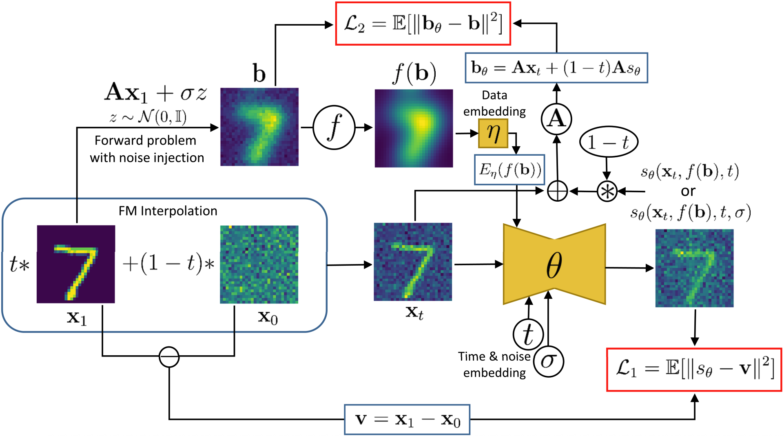

# DAWN-FM: Data-Aware and Noise-Informed Flow Matching for Solving Inverse Problems

This repository contains the official implementation for the paper:

> S. Ahamed, E. Haber, _DAWN-FM: Data-Aware and Noise-Informed Flow Matching for Solving Inverse Problems_, Foundations of Data Science (AIMS), Jan 2026, doi: [10.3934/fods.2026005](https://www.aimsciences.org//article/doi/10.3934/fods.2026005).

## Overview

This repository provides clean, consolidated implementations of:
- **DAW-FM**: Data-Aware Flow Matching (with data embedding only)
- **DAWN-FM**: Data-Aware Noise-Informed Flow Matching (with data and noise embedding)

Both methods are applied to two inverse problems:
1. **Image Deblurring**: on MNIST, CIFAR10, and STL10 datasets
2. **Tomography Reconstruction**: on OrganCMNIST, OrganAMNIST, and OrganSMNIST datasets

## Abstract 
Inverse problems, which involve estimating parameters from incomplete or noisy observations, arise in various fields such as medical imaging, geophysics, and signal processing. These problems are often ill-posed, requiring regularization techniques to stabilize the solution. In this work, we employ Flow Matching (FM), a generative framework that integrates a deterministic processes to map a simple reference distribution, such as a Gaussian, to the target distribution. Our method DAWN-FM: Data-AWare and Noise-Informed Flow Matching incorporates data and noise embedding, allowing the model to access representations about the measured data explicitly and also account for noise in the observations, making it particularly robust in scenarios where data is noisy or incomplete. By learning a time-dependent velocity field, FM not only provides accurate solutions but also enables uncertainty quantification by generating multiple plausible outcomes. Unlike pretrained diffusion models, which may struggle in highly ill-posed settings, our approach is trained specifically for each inverse problem and adapts to varying noise levels. We validate the effectiveness and robustness of our method through extensive numerical experiments on tasks such as image deblurring and tomography.

<p align="center">
  
</p>

**Figure 1:** Schematics for standard flow matching (FM) (left) and flow matching for solving inverse problem characterized by the forward problem $\mathbf{A}$ along with an additive noise scale $\sigma$ (right). Here, $\mathbf{s}_\theta$ represents the trained network for estimating the velocity along the trajectory $\mathbf{x}_t$ at time $t$ between the reference distribution $\pi_0$ and the target distribution $\pi_1$ and $f$ represents a transformation on the measured (noisy) data which is used as data-embedding into the flow-matching network on the right.

## Key Features

- ✅ Unified training scripts for deblurring and tomography tasks
- ✅ Unified inference scripts with comprehensive metric computation
- ✅ Support for both DAW-FM and DAWN-FM training modes
- ✅ Command-line interface for easy experimentation
- ✅ Efficient FFT-based blur operators and matrix-based 2D tomography operators
- ✅ Multi-GPU inference support for faster processing
- ✅ Comprehensive evaluation metrics (PSNR, SSIM, MSE, data misfit)
- ✅ Support for MNIST, CIFAR10, STL10, and MedMNIST datasets

## Installation

### Requirements

- Python 3.8+
- PyTorch 2.0+
- CUDA 12.8

### Setup

```bash
# Clone the repository
git clone https://github.com/yourusername/DAWN-FM.git
cd DAWN-FM

# Install dependencies
pip install -r requirements.txt
```

### Data Setup

By default, all scripts use `./data` as the data directory. Datasets will be **automatically downloaded** on first use.

You can organize your data directory as follows:

```
DAWN-FM/
├── data/                        # Default data directory
│   ├── MNIST/                   # Auto-downloaded MNIST dataset
│   ├── CIFAR10/                 # Auto-downloaded CIFAR10 dataset
│   ├── STL10/                   # Auto-downloaded STL10 dataset
│   └── medmnist/                # Auto-downloaded MedMNIST datasets
│       ├── organcmnist.npz
│       ├── organamnist.npz
│       └── organsmnist.npz
├── train_deblurring.py
└── ...
```

**Note**: To use a different data directory, specify `--data_dir /your/custom/path` when running scripts.
```

## Project Structure

```
DAWN-FM/
├── train_deblurring.py          # Training script for deblurring
├── inference_deblurring.py      # Inference script for deblurring
├── train_tomography.py          # Training script for tomography
├── inference_tomography.py      # Inference script for tomography
├── dawnfm/                      # Core package
│   ├── models.py                # Network architectures (UNetFMG_DE, UNetFMG_DE_NE)
│   ├── forward_problems.py      # Forward operators (blur, tomography)
│   ├── load_datasets.py         # Dataset loading utilities
│   ├── config.py                # Configuration utilities
│   └── utils.py                 # Utility functions
├── requirements.txt             # Python dependencies
├── README.md                    # This file
└── LICENSE                      # License file
```

## Quick Start

### Training

#### Deblurring Task

#### DAW-FM (Data Embedding Only)

Train on MNIST:
```bash
python train_deblurring.py \
    --dataset mnist \
    --batch_size 512 \
    --max_epochs 1000 \
    --save_dir ./experiments
```

Train on CIFAR10:
```bash
python train_deblurring.py \
    --dataset cifar10 \
    --batch_size 512 \
    --max_epochs 1000 \
    --save_dir ./experiments
```

#### DAWN-FM (Data + Noise Embedding)

Train on MNIST with noise embedding:
```bash
python train_deblurring.py \
    --dataset mnist \
    --use_noise_embed \
    --noise_range 0.0 0.1 \
    --batch_size 512 \
    --max_epochs 1000 \
    --save_dir ./experiments
```

Train on CIFAR10 with noise embedding:
```bash
python train_deblurring.py \
    --dataset cifar10 \
    --use_noise_embed \
    --noise_range 0.0 0.1 \
    --batch_size 512 \
    --max_epochs 1000 \
    --save_dir ./experiments
```

#### Tomography Task

##### DAW-FM (Data Embedding Only)

Train on OrganCMNIST:
```bash
python train_tomography.py \
    --dataset organcmnist \
    --img_size 64 \
    --batch_size 128 \
    --max_epochs 1000 \
    --num_angles 180 \
    --save_dir ./experiments
```

Train on OrganAMNIST:
```bash
python train_tomography.py \
    --dataset organamnist \
    --img_size 64 \
    --batch_size 128 \
    --max_epochs 1000 \
    --num_angles 180 \
    --save_dir ./experiments
```

##### DAWN-FM (Data + Noise Embedding)

Train on OrganCMNIST with noise embedding:
```bash
python train_tomography.py \
    --dataset organcmnist \
    --use_noise_embed \
    --img_size 64 \
    --noise_range 0.0 0.1 \
    --batch_size 128 \
    --max_epochs 1000 \
    --num_angles 180 \
    --save_dir ./experiments
```

### Inference
#### Deblurring Task

Run inference on test set:

```bash
python inference_deblurring.py \
    --dataset mnist \
    --model_path ./experiments/models/mnist_daw-fm_arch-1x16x32/model_ep=1000.pth \
    --noise_level 0.0 \
    --nsteps 100 \
    --num_runs 32 \
    --save_dir ./results
```

For DAWN-FM models, add the `--use_noise_embed` flag:

```bash
python inference_deblurring.py \
    --dataset mnist \
    --use_noise_embed \
    --model_path ./experiments/models/mnist_dawn-fm_arch-1x16x32/model_ep=1000.pth \
    --noise_level 0.05 \
    --nsteps 100 \
    --num_runs 32 \
    --save_dir ./results
```

### Multi-GPU Inference

For faster inference, distribute the dataset across multiple GPUs:

```bash
# Use GPUs 0, 1, and 2 for parallel inference
python inference_deblurring.py \
    --dataset cifar10 \
    --model_path ./experiments/models/cifar10_daw-fm_arch-3x16x32/model_ep=1000.pth \
    --gpus 0 1 2 \
    --noise_level 0.0 \
    --nsteps 100 \
    --num_runs 32 \
    --save_dir ./results
```

The `--gpus` flag automatically splits the test dataset across the specified GPUs and runs inference in parallel. Each GPU processes its assigned subset independently, significantly reducing total inference time.

#### Tomography Task

Run inference on test set:

```bash
python inference_tomography.py \
    --dataset organcmnist \
    --img_size 64 \
    --model_path ./experiments/models/tomography_organcmnist_daw-fm_arch-1x16x32x64x128/model_ep=1000.pth \
    --num_angles 180 \
    --noise_level 0.0 \
    --nsteps 100 \
    --num_runs 32 \
    --save_dir ./results
```

For DAWN-FM models, add the `--use_noise_embed` flag:

```bash
python inference_tomography.py \
    --dataset organcmnist \
    --use_noise_embed \
    --img_size 64 \
    --model_path ./experiments/models/tomography_organcmnist_dawn-fm_arch-1x16x32x64x128/model_ep=1000.pth \
    --num_angles 180 \
    --noise_level 0.07 \
    --nsteps 100 \
    --num_runs 32 \
    --save_dir ./results
```

Multi-GPU inference for tomography:

```bash
# Use GPUs 1 and 2 for parallel tomography inference
python inference_tomography.py \
    --dataset organcmnist \
    --use_noise_embed \
    --img_size 64 \
    --model_path ./experiments/models/tomography_organcmnist_dawn-fm_arch-1x16x32x64x128/model_ep=1000.pth \
    --gpus 1 2 \
    --num_angles 180 \
    --noise_level 0.07 \
    --nsteps 100 \
    --num_runs 32 \
    --save_dir ./results
```

## Training Arguments

### Deblurring Task

#### Dataset Options
- `--dataset`: Dataset to use (`mnist`, `cifar10`, `stl10`)
- `--data_dir`: Directory containing datasets (default: `./data/`)

#### Model Options
- `--use_noise_embed`: Use noise embedding (DAWN-FM mode)
- `--arch`: Network architecture (auto-determined if not specified)
  - Default: `[1, 16, 32]` for MNIST, `[3, 16, 32]` for RGB

#### Training Options
- `--batch_size`: Batch size (default: 512)
- `--max_epochs`: Maximum number of epochs (default: 1000)
- `--lr`: Learning rate (default: 1e-4)
- `--lr_min`: Minimum learning rate for scheduler (default: 0)
- `--num_workers`: Number of data loading workers (default: 4)

#### Forward Problem Options
- `--blur_sigma`: Gaussian blur kernel sigma `[sigma_x, sigma_y]` (default: `[3.0, 3.0]`)
- `--noise_range`: Noise level range `[min, max]` as fraction of data range (default: `[0.0, 0.1]`)

#### Other Options
- `--interpolation_sigma`: Sigma for stochastic interpolation (default: 0.01)
- `--save_dir`: Directory to save experiments (default: `./experiments`)
- `--save_every`: Save checkpoint every N epochs (default: 25)
- `--device`: Device to use (auto-detected if not specified)

### Tomography Task

#### Dataset Options
- `--dataset`: Dataset to use (`organcmnist`, `organamnist`, `organsmnist`)
- `--data_dir`: Directory containing datasets (default: `./data/`)
- `--img_size`: Image size (default: 64)

#### Model Options
- `--use_noise_embed`: Use noise embedding (DAWN-FM mode)
- `--arch`: Network architecture (default: `[1, 16, 32, 64, 128]`)

#### Training Options
- `--batch_size`: Batch size (default: 128)
- `--max_epochs`: Maximum number of epochs (default: 1000)
- `--lr`: Learning rate (default: 1e-4)
- `--lr_min`: Minimum learning rate for scheduler (default: 0)
- `--num_workers`: Number of data loading workers (default: 4)

#### Forward Problem Options
- `--num_angles`: Number of projection angles for tomography (default: 180)
- `--noise_range`: Noise level range `[min, max]` as fraction of data range (default: `[0.0, 0.1]`)

#### Other Options
- `--interpolation_sigma`: Sigma for stochastic interpolation (default: 0.01)
- `--save_dir`: Directory to save experiments (default: `./experiments`)
- `--save_every`: Save checkpoint every N epochs (default: 1)
- `--device`: Device to use (auto-detected if not specified)

## Inference Arguments

### Deblurring Task

#### Dataset Options
- `--dataset`: Dataset to use (`mnist`, `cifar10`, `stl10`)
- `--data_dir`: Directory containing datasets (default: `./data/`)

#### Model Options
- `--model_path`: Path to trained model checkpoint (required)
- `--use_noise_embed`: Use noise embedding (must match training)
- `--arch`: Network architecture (auto-determined if not specified)

#### Inference Options
- `--noise_level`: Noise level as fraction of data range (default: 0.0)
- `--nsteps`: Number of ODE solver steps (default: 100)
- `--num_runs`: Number of reconstructions per image (default: 2)
- `--batch_size`: Batch size for inference (default: 1)

#### Other Options
- `--blur_sigma`: Blur kernel sigma (default: `[3.0, 3.0]`)
- `--save_dir`: Directory to save results (default: `./results`)
- `--device`: Device to use (e.g., `cuda:0`, `cpu`). Ignored if `--gpus` is specified
- `--gpus`: GPU IDs for parallel inference (e.g., `--gpus 0 1 2`). Automatically splits dataset across GPUs
- `--n_jobs`: Number of parallel jobs for metrics (default: 8)

### Tomography Task

#### Dataset Options
- `--dataset`: Dataset to use (`organcmnist`, `organamnist`, `organsmnist`)
- `--data_dir`: Directory containing datasets (default: `./data/`)
- `--img_size`: Image size (default: 28)

#### Model Options
- `--model_path`: Path to trained model checkpoint (required)
- `--use_noise_embed`: Use noise embedding (must match training)
- `--arch`: Network architecture (default: `[1, 16, 32, 64, 128]`)

#### Inference Options
- `--noise_level`: Noise level as fraction of data range (default: 0.0)
- `--nsteps`: Number of ODE solver steps (default: 100)
- `--num_runs`: Number of reconstructions per image (default: 32)
- `--batch_size`: Batch size for inference (default: 1)

#### Other Options
- `--num_angles`: Number of projection angles (default: 360)
- `--save_dir`: Directory to save results (default: `./results`)
- `--device`: Device to use (e.g., `cuda:0`, `cpu`). Ignored if `--gpus` is specified
- `--gpus`: GPU IDs for parallel inference (e.g., `--gpus 1 2`). Automatically splits dataset across GPUs
- `--n_jobs`: Number of parallel jobs for metrics (default: 8)

## Output Structure

### Training Outputs

```
experiments/
├── logs/
│   ├── deblurring_{dataset}_{mode}_arch-{arch}/
│   │   └── train_logs.csv        # Training loss logs
│   └── tomography_{dataset}_{mode}_arch-{arch}/
│       └── train_logs.csv
└── models/
    ├── deblurring_{dataset}_{mode}_arch-{arch}/
    │   ├── model_ep=0025.pth     # Checkpoints
    │   └── ...
    └── tomography_{dataset}_{mode}_arch-{arch}/
        ├── model_ep=0001.pth
        └── ...
```

### Inference Outputs

```
results/
├── generated_images/
│   ├── deblurring_{dataset}_{mode}_{noise}/
│   │   ├── mnist_000000.npy      # Saved reconstructions
│   │   └── ...
│   └── tomography_{dataset}_{mode}_{noise}/
│       ├── organcmnist_test_000000.npy
│       └── ...
└── metrics/
    ├── deblurring_{dataset}_{mode}_{noise}/
    │   └── metrics.csv           # Evaluation metrics
    └── tomography_{dataset}_{mode}_{noise}/
        └── metrics.csv
```

### Saved Image Format

#### Deblurring
Each `.npy` file contains a stack of images with shape:
- `[2 + num_runs, H, W]` for grayscale (MNIST)
- `[2 + num_runs, H, W, 3]` for RGB (CIFAR10, STL10)

Stack order: `[original, blurred_data, recon_1, recon_2, ..., recon_N]`

#### Tomography
Each `.npy` file contains a stack of images with shape:
- `[1 + num_runs, H, W]` for grayscale (all MedMNIST datasets)

Stack order: `[original, recon_1, recon_2, ..., recon_N]`

Note: Sinogram data is not saved due to different dimensions.

## Metrics

The inference scripts compute the following metrics:
- **MSE**: Mean Squared Error
- **PSNR**: Peak Signal-to-Noise Ratio (dB)
- **SSIM**: Structural Similarity Index
- **MISFIT**: Data consistency metric (relative norm of residual)

Metrics are computed for:
1. Each individual reconstruction (2-32 runs depending on task)
2. The mean reconstruction across all runs

## Architecture Details

### Training Process
<p align="center">
  
</p>

**Figure 2:** Schematic of the training process for the FM model for solving inverse problem, where the forward model is given by $\mathbf{A}$. This figure specifically represents the deblurring inverse problem. The network with parameters $\theta$ may or may not incorporate the noise embedding (see Section 4 of the paper for details). The two loss terms $\mathcal{L}_1$ and $\mathcal{L}_2$ represent the error in prediction of velocity and misfit, respectively. In this figure, the transformation $f$ for generating the data embedding was chosen as $f = \mathbf{A}^\top$.

### UNetFMG_DE (DAW-FM)
- U-Net with data embedding
- **Inputs**: current image, time, adjoint of measurement data
- **Deblurring**: Adjoint is deconvolved/backprojected blurred image
- **Tomography**: Adjoint is backprojected sinogram

### UNetFMG_DE_NE (DAWN-FM)
- U-Net with data and noise embedding
- **Inputs**: current image, time, adjoint of measurement data, noise level
- Same architecture as DAW-FM but with additional noise embedding layers
- **Deblurring**: Noise level encoded per-image based on blur + additive noise
- **Tomography**: Noise level encoded per-image based on sinogram noise

### Forward Operators

#### Deblurring (`blurFFT`)
- FFT-based Gaussian blur convolution
- Efficient computation in Fourier domain
- Configurable blur kernel sigma

#### Tomography (`Tomography`)
- Matrix-based Radon transform approximation
- Configurable number of projection angles (default: 180-360)
- Optional Hamming filter for filtered backprojection

## Datasets

### Deblurring Tasks
- **MNIST**: 28×28 grayscale handwritten digits
- **CIFAR10**: 32×32 RGB natural images
- **STL10**: 64×64 RGB natural images

### Tomography Tasks
- **OrganCMNIST**: 64×64 grayscale abdominal CT organ scans (coronal plane)
- **OrganAMNIST**: 64×64 grayscale abdominal CT organ scans (axial plane)
- **OrganSMNIST**: 64×64 grayscale abdominal CT organ scans (sagittal plane)

All datasets are automatically downloaded on first use.

## Citation

If you use this code in your research, please cite:

```bibtex
@article{ahamed2026dawn,
  title={Data-Aware and Noise-Informed Flow Matching for Solving Inverse Problems},
  author={S. Ahamed, E. Haber},
  journal={Foundations of Data Science},
  year={2026},
  doi={10.3934/fods.2026005}
}
```

## License

This project is licensed under the MIT License - see the [LICENSE](LICENSE) file for details.


